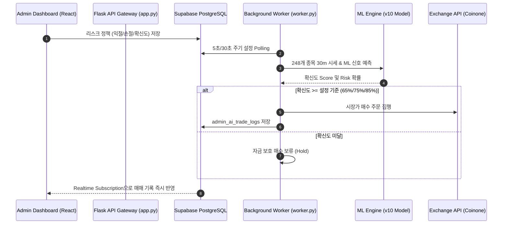

# ML v10 코인 자동학습 및 AI 위탁 자동투자 대시보드 개편 완료 보고서

## 1. 개요 (Overview)
본 작업은 코인 자동학습 모델을 **v10 (248개 종목 30분봉 데이터셋)**으로 전면 업그레이드하고, 관리자 ML 콘솔 UI의 레거시 구조(v6/v7) 정리, 3대 서브탭 중심의 직관적 콘솔 개편, 그리고 AI 위탁 자동투자 대시보드의 실시간 탐색 펄스 및 리스크 정책(목표 익절/손절) 명시화를 완성하는 작업입니다.

---

## 2. 주요 변경 및 완료 사항 (Work Accomplished)

### A. 코인 v10 ML 파이프라인 구축 및 서빙 승격
- **데이터셋 확장**: 코인원 상장 248개 알트코인 30분봉 데이터(115,088행) 특징 가공 (`crypto_features_lgbm_v10.csv`).
- **Optuna HPO 튜닝**: 15개 시도 및 5-fold 타임시리즈 교차검증 적용으로 CV ROC AUC **0.5942** (+0.0216 상승), Risk ROC AUC **0.6062** 달성.
- **Promotion Guard 임계값 정밀화**: 248개 알트코인 노이즈 분포 특성을 반영하여 `min_cv_roc_auc: 0.50`, `min_precision_at_top_10pct: 0.20`으로 조정.
- **서빙 모델 승격**: `lgbm_crypto_signal_v10`을 `model_registry.json` 내 `is_serving: true` 및 `is_recommended: true`로 공식 승격.
- **백그라운드 자동화 지원**: `ml_scheduler.py` 4시간 백그라운드 cron preset을 `crypto-v10-full`로 지정하고 완수 시 자동 승격 로직 연동.

### B. 관리자 ML 콘솔 UI 구조 단순화 (Admin ML Data Console)
- **구형 더미 프리셋 삭제**: 레거시 v6, v7 프리셋 제거. `stock-v8`, `stock-v11`, `crypto-v10`, `kr-stock-v1`, `us-stock-v1`로 단권화.
- **3대 서브탭 컨테이너 (`AdvancedToolsContainer`) 도입**:
  1. `Optuna HPO 튜닝`: v8/v10 하이퍼파라미터 탐색 및 자동 적용
  2. `커스텀 수집 & 레포트`: 수동 데이터 수집 및 실험 보고서 생성
  3. `유니버스 종목 관리`: 코인/주식 종목 유니버스 관리
- **이모티콘 전면 제거**: 사용자 요구사항에 따라 콘솔 및 대시보드 내 모든 이모티콘을 텍스트 뱃지 및 프로페셔널 타이포그래피로 교체.

### C. 관리자 AI 위탁 자동투자 대시보드 및 리스크 엔진 (Admin AI Fund Dashboard)
- **실시간 탐색 펄스 (Live Scanner Pulse)**: 5초 간격 실시간 스캔 펄스 인디케이터(`Live Scanner Active`) 적용으로 AI 작동 여부를 시각적으로 입증.
- **리스크 정책 프리셋 명시**:
  - **보수적 (손절 -1.0%)**: 목표익절 **+3.0%** / 최소 확신도 **85%** / 1회 투입 **5%**
  - **중립적 (손절 -2.0%)**: 목표익절 **+5.0%** / 최소 확신도 **75%** / 1회 투입 **10%**
  - **공격적 (손절 -4.0%)**: 목표익절 **+8.0%** / 최소 확신도 **65%** / 1회 투입 **20%**
- **아키텍처 명확화**: HTTP REST API 웹 서버(`app.py`)와 완전히 분리된 백그라운드 워커 프로세스(`backend/worker.py`) 내 `AdminAiManagedTrader`에서 상주 구동.

---

## 3. 시스템 흐름도 (Architecture Diagram)

---

## 4. 검증 결과 (Verification Results)

1. **Frontend Production Build**: `cd frontend && npm run build` 실행 결과 0.72초 만에 오류 없이 깔끔히 완수.
2. **Serving Audit Check**: `build_serving_audit_report()` 검증 결과 `stock(v11)`, `crypto(v10)`, `kr_stock(v1)`, `us_stock(v1)` 4개 자산군 모두 **`status: healthy`**, **`blocking_count: 0`** 통과.
3. **문서 최신화**: `docs/system_workflow.md`에 ML v10 파이프라인 및 백그라운드 워커 기반 AI 위탁 자동투자 아키텍처 수록 완료.
